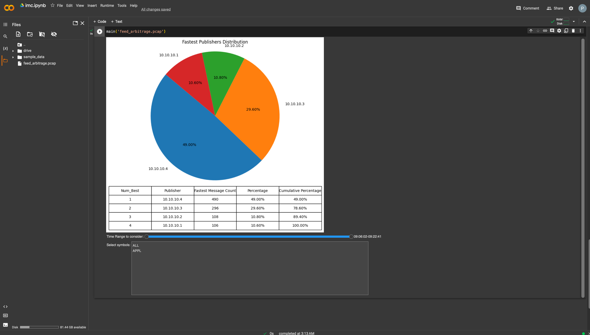

# IMCFeedArbitration

## Name: Prem Sakore

### Requirements:
- The exchange normally charges extra for each subscription and we would like
to keep only NUM_BEST out of all publishers, e.g. two out of four.
- You would need to calculate a metric(s) and/or visualize the data in order to
present findings to your colleagues – explaining which publishers are best.
- We would like you to explain the thought process and how/why did you pick
the method/metrics you did.
- The data (packets) input to your program is some PCAP file.

### Goals:
- We would like to see how you translate requirements into a technical design.
- We want to see how you translate the design into code.
- The correctness of the code and your coding style are equally important to us.

### Approach:
- I used python to calculate metrics and visualize the data for which I have used google colab platform to make the visualization interactive
- First I did the processing of packets, in which we read the packets data and create a dictionary from it. Every Symbol_Seqno is a unique way to identify same message in different publishers
- So I created a dictionary from every Symbol_Seqno combination to every publishers message time recorded in the packet
- After that I converted this to a dataframe, then calculated for every Symbol_Seqno that from which publisher we received this message first
- After we have this data available we can visualize this data in form of pie chart and table
- Pie chart shows for how much percentage of messages we received from a publisher were the fastest messages
- Table shows 'Num_Best', 'Publisher', 'Fastest Message Count', 'Percentage', 'Cumulative Percentage' values
  - It can be read as If we want to select Num_Best number of publishers then All the publishers till that Num_Best should be selected and Cumulative Percentage of that Num_Best will tell us that we will get that much percentages of messages fastest after only considering the Num_Best publishers
  - Fastest Message Count is the Number of messages which we received were the fastest from that Publisher
  - Percentage denotes the above info in percentage form
  
### User Interactive Visualization:
- The Plot is interactive, user has the option to Select a particular time frame, if a particular time frame is selected then output shown is only for the selected time frame. A range selector is provided for the same which shows the time in HH:MM:SS format considering the pcap will have data for only one day.
- User can also select Symbols, so if user wants to check the metrics only for a particular symbol or group of symbols then that is also possible. A Multiple selector widget is available for the same where a user can select one or multiple symbols. 

### How to Run:
- Open imc.ipynb in the repo root on github, I has a link which says "Open in Colab", clicking on it will open this file in google colab.
- On google colab, login and then go to "Runtime" toolbar option and select "Run all"
- This will automatically download the feed_arbitrage.pcap in the google colab environment and create a Pie chart and a Table
- By default the Time Range is selected for the total pcap and All symbols are selected
- User can change the Time Range to consider metrics calculation and visualization only for a selected time frame
- User can also select Symbols to calculate metrics and visualize the metrics for only the selected symbols (In the provided data only one Symbol's (AAPL) messages are present )
- To run this for a different pcap, user can directly upload the pcap file to google colab and pass the path in main() function.

### Example:
- In the following output the complete time range is considered. Pie chart is showing that for 49% of the time we received the fastest message from publisher 10.10.10.4, 29.6% of time it was from 10.10.10.3, 10.8% of time from 10.10.10.2 and 10.6% of time from 10.10.10.1
- Table shows that if we want to select say 2 Num_Best publishers, i.e. two fastest publishers then we should pick 10.10.10.4 and 10.10.10.3, for which we are getting 78.6% (Cumulative percentage) of messages as the fastest messages. If we choose 3 Best publishers instead of 2 we will get 89.4% of messages fastest instead of 78.6% with 2 publishers.
- From this table we can decide what should be Num_Best to have say atleast 90% of messages fastest and which Publishers should be choosen for achieving the same. 

